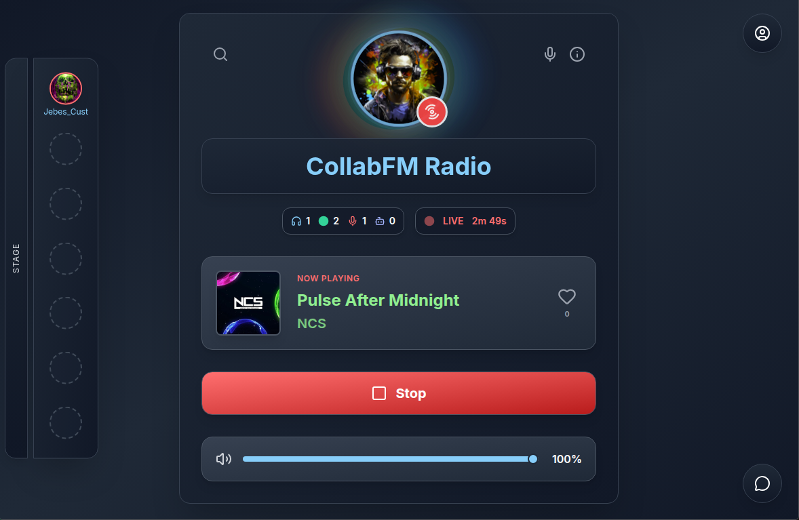
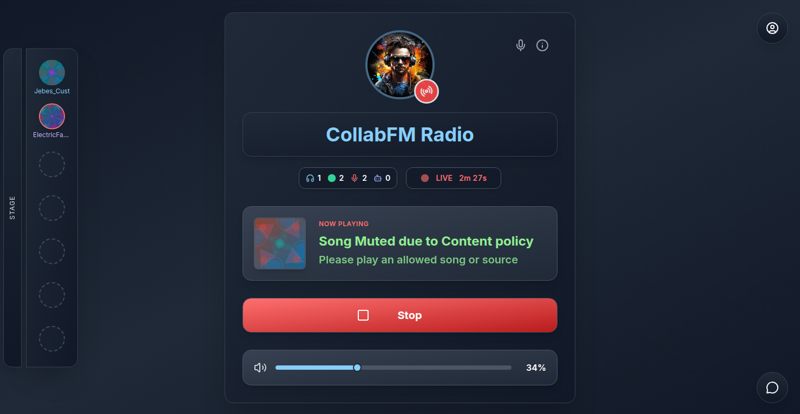

# CollabFM

**GHCR:** `ghcr.io/alecmccutcheon/collabfm-radio:latest`

Licensed under [CC BY-NC 4.0](LICENSE) — © Alec McCutcheon

CollabFM is a **collaborative, self-hosted social radio platform** built for friends and communities.

Instead of one person running a show alone, multiple broadcasters can join the **stage**, take turns DJing, chat with listeners, and hand off the live broadcast without interrupting the stream. Listeners tune in through the web interface, direct stream URLs, or an optional Discord voice bot—so you can share live audio together across browsers, Discord, and media players.

## Preview

<p align="center">
  
</p>

<p align="center">
  
</p>

<p align="center">
  
</p>

## Why CollabFM?

- 🎙️ Multiple DJs can join the stage and hand off the live broadcast
- 🌐 Self-hosted with local accounts or OIDC
- 💬 Live chat, synced reactions, and party effects
- 🤖 Optional Discord voice bot
- 👥 Guest listener and broadcaster links
- 🎵 Browser or [Chrome extension](https://chromewebstore.google.com/detail/collabfm-broadcaster/nnalcbfijmoobcgejgnbmdimnekedpba) broadcasting (Web Store or server ZIP)
- 🛡️ Configurable content policy for allowed sources, licenses, and artists
- ❤️ XP, levels, hearts, and community-focused features

## Try a live instance

Want to play with a running CollabFM before self-hosting? Join the [Discord server](https://discord.gg/7bTRzEunSz). Guest access is at the admin’s discretion—when `@Jebes_Cust` or another radio admin is online and using it, say you’d like to try it. No guarantees on timing or access.

- **Architecture:** [docs/ARCHITECTURE.md](./docs/ARCHITECTURE.md) (includes [API access tiers](./docs/ARCHITECTURE.md#api-access) and [broadcaster extension layout](./docs/wiki/Broadcaster-Extension.md))
- **Audio pipeline:** [docs/audio-pipeline.md](./docs/audio-pipeline.md)
- **Roadmap:** [docs/ROADMAP.md](./docs/ROADMAP.md)
- **Default policy rationale:** [docs/WHY.md](./docs/WHY.md)
- **Guides (UI & integrations):** [docs/wiki/Home.md](./docs/wiki/Home.md)

---

## About this project

CollabFM started as a personal project because I wanted something that didn’t really exist: a **private social radio where friends could take turns DJing** instead of relying on algorithmic playlists or commercial streaming services. Over time it grew into a standalone platform with browser broadcasting, guest access, Discord integration, and a real-time social layer on top of the stream.

I use CollabFM myself and plan to keep improving it. [Issues](https://github.com/AlecMcCutcheon/collabfm-radio/issues) (bugs, questions), feature requests, and [pull requests](https://github.com/AlecMcCutcheon/collabfm-radio/pulls) are welcome—I read them when I can, but I can’t promise fixes on a fixed schedule.

For most users, DJ switching, Discord listening, and the web UI are a **smooth experience**. The live audio path can still hit **occasional hiccups**—brief stalls or encoding glitches that **usually self-recover** on the backend, but there is room to do better on latency, reliability, and edge cases. If you know streaming or audio pipelines, have stress-tested your own instance, or want to help harden the encode path, [issues](https://github.com/AlecMcCutcheon/collabfm-radio/issues) and [pull requests](https://github.com/AlecMcCutcheon/collabfm-radio/pulls) in that area are especially welcome. See [docs/audio-pipeline.md](./docs/audio-pipeline.md) for how the stack fits together.

If CollabFM helps you, [donations are appreciated](https://www.paypal.com/donate/?business=YSFG23ABNS6HY&no_recurring=0&item_name=If+my+projects+help+you%2C+donations+are+appreciated.+Feedback%2C+issues%2C+or+PRs+help+too%21&currency_code=USD)—issues and PRs help too. Site-specific extension support (metadata, license scraping, stage media controls) is a good first contribution—see [Broadcaster Extension](./docs/wiki/Broadcaster-Extension.md) and [`backend/broadcaster-extension/sites/CONTRIBUTING.md`](./backend/broadcaster-extension/sites/CONTRIBUTING.md).

---

## Roadmap

Planned directions and ideas—not a schedule or promise of delivery:

- ✅ ~~**Content policy**~~ — configurable source and artist allowlists enforced by default; metadata-based filtering (not audio analysis), admin UI, extension integration, and [wiki guide](./docs/wiki/Content-Policy.md).
- ✅ ~~**Content policy — licensing & stricter defaults**~~ — FMA-first default source; Creative Commons license allowlist with flexible matching; license safety rails; FMA metadata and license scraping; source/license links on now-playing and session log; policy re-check on DJ switch.
- ✅ ~~**Dynamic stage UI**~~ — stage slots in the GUI match the configured max stage users (Admin → Radio).
- ✅ ~~**Container update notifications**~~ — Admin → System → Container updates: track `latest` or `develop` on GHCR, get a banner when a newer **published** image is pullable; each image bakes in its own build ID. See [Upgrading](#container-update-notifications) and [Admin Panel](./docs/wiki/Admin-Panel.md#tab-system).
- ✅ ~~**Broadcaster extension — site adapters**~~ — per-site folders under `backend/broadcaster-extension/sites/`; [wiki guide](./docs/wiki/Broadcaster-Extension.md) and [`sites/CONTRIBUTING.md`](./backend/broadcaster-extension/sites/CONTRIBUTING.md).
- ✅ ~~**FMA support**~~ — extension metadata and license scraping from track pages; `freemusicarchive.org` in default content policy; source and license links on now-playing.
- ✅ ~~**Jamendo support**~~ — extension metadata, license enrichment, stage media controls; `jamendo.com` in default content policy.
- ✅ ~~**Chrome Web Store listing**~~ — [CollabFM Broadcaster](https://chromewebstore.google.com/detail/collabfm-broadcaster/nnalcbfijmoobcgejgnbmdimnekedpba) for easier install and Chrome auto-updates; Go live modal shows server ZIP vs store version.
- ✅ ~~**Chrome Web Store stage workflow**~~ — CI uploads extension ZIP on `main` (upload only, skips when in review); **submit for review manually** in the Developer Dashboard when ready (intentional).
- ⏳ **Hybrid users** — optional local password on SSO-linked accounts (and related account management).
- ⏳ **Gated registration** — access-request form, admin approve/deny queue, one-time enrollment tokens.
- ⏳ **Off-site update alerts** — email or Discord DM beyond the in-app Admin container banner.

More detail on each item: [docs/ROADMAP.md](./docs/ROADMAP.md).

---

## Legal & responsible use

CollabFM **does not host, store, or provide any audio content.** It is relay and coordination software: broadcasters supply audio from their own browser tabs or other sources, and your instance forwards that stream to listeners you authorize.

CollabFM provides a **configurable content policy** that **implements best-effort filtering based on metadata** by default to help operators and broadcasters manage what audio may be relayed through their station. The policy engine is a **filtering tool**, not a copyright detector—it applies your allowlists and fallbacks to metadata reported by the extension; it does not analyze audio, fingerprint tracks, or verify licenses. Administrators can adjust rules in Admin → System.

**Your responsibility.** Server administrators and broadcasters are solely responsible for ensuring they have the necessary rights, licenses, or permissions to stream any audio. New installs default to [Free Music Archive (CC search)](https://freemusicarchive.org/search?adv=1&music-filter-CC-attribution-only=true&music-filter-CC-attribution-sharealike=1&music-filter-CC-attribution-noderivatives=1&music-filter-CC-attribution-noncommercial=1&music-filter-CC-attribution-noncommercial-sharealike=true&music-filter-CC-attribution-noncommercial-noderivatives=true) and [Jamendo (explore)](https://www.jamendo.com/explore) with standard Creative Commons license patterns (CC BY, CC BY-SA, CC BY-NC, CC BY-NC-SA, CC BY-ND, CC BY-NC-ND, CC0). Those sources are included because they provide **machine-readable license metadata** that can assist with compliance checks. Inclusion does not guarantee legal compliance in all contexts. CC content may still require attribution, share-alike compliance, or other obligations; metadata can be mis-tagged. CollabFM is itself [CC BY-NC 4.0](LICENSE); default policy favors the same non-commercial CC family. The broadcaster extension can capture audio from many tab sources, but only sources on your allowlist are permitted by default policy. Admins must verify compliance and may configure additional sources at their own discretion and responsibility.

**Content you broadcast.** Only stream material you have the right to share—your own recordings, properly licensed works, or content clearly permitted for redistribution. Do not use CollabFM to redistribute copyrighted music or other protected works without authorization from the rights holder.

**Private and invited audiences.** CollabFM is intended as a self-hosted station for private or invited listeners—friends, community servers, homelab users—not as a public commercial broadcast service. You control who can listen through authentication, share links, and how you expose the service on your network.

**Policy filtering.** By default, the content policy attempts to mute disallowed sources and withhold blocked track metadata from the website and Discord while a decision is pending. Promoting or switching the live DJ on stage triggers a policy re-check that is intended to **mitigate accidental display** of blocked track metadata on now-playing and in the session log. These controls promote responsible use and help reduce accidental policy violations; they are **not a guarantee** that disallowed content was prevented, and they are not a substitute for legal compliance. CollabFM does not condone intentional misuse or deliberate circumvention of this policy.

**Software disclaimer.** CollabFM is provided as-is, without warranty. The author is not liable for operator misuse, copyright claims, or other consequences arising from how you deploy or use the software.

**License.** This project is licensed under [Creative Commons Attribution-NonCommercial 4.0 International](LICENSE). You may use and modify it for non-commercial purposes; commercial use is not permitted. If you share the software or derivatives, you must give appropriate credit to Alec McCutcheon and indicate if changes were made.

Configuration details: [Content Policy (wiki)](docs/wiki/Content-Policy.md). Design rationale for conservative defaults: [docs/WHY.md](./docs/WHY.md).

---

## Shared radio experience

The main idea is a **shared station** where people **take turns DJing**—promote someone on the **Stage**, **chat** with the room, fire **synced party effects** everyone sees on the web UI, request songs, and listen to whoever is live on the **main stream**.

| Where you listen | What you hear |
|------------------|---------------|
| **Web UI / `/api/stream`** | The **main station** only—one live DJ for the whole room (whoever was promoted on stage). |
| **Discord voice bot** | **Main station** (follows the live DJ) **or** a **specific DJ’s feed** on stage—your choice per voice channel. |

That split is intentional: if you want to focus on **your own broadcast** (or one DJ) without the group following along on the website, use Discord and pick that DJ with `/station` or the station dropdown on the now-playing message. On the open web stream, you’re always on the shared main station with everyone else.

### Social layer (web UI)

Everyone on the website sees the same room in real time:

- **Live chat** — open the message icon (desktop) or **Chat** tab (mobile); role badges, typing indicator, optional **GIF** posts when Giphy is configured.
- **Party effects** — **right-click** the radio background for fireworks, arrivals, flying reactions, and more; effects play for **all listeners and guests** on that station. **Right-click** someone’s avatar on **Stage** or in **chat** for profile reactions (wave, high five, etc.).
- **Hearts** — support the live DJ from the now-playing area (DJ leveling / XP).

Step-by-step: [Chat & Party Effects](docs/wiki/Chat-and-Party-Effects.md).

See [Discord Voice Bot Setup](docs/wiki/Discord-Voice-Bot-Setup.md) for `/join`, `/station`, `/leave`, and the live now-playing embed.

---

## What you get

| Area | Summary |
|------|---------|
| **Main station** | Live MP3 stream, now-playing metadata, album art, **live chat** (GIFs when configured), **synced party effects**, request queue, hearts for DJs |
| **Stage** | See who is on air, promote DJs, tune Discord bots per host, hearts / leveling |
| **Broadcasters** | Chrome extension (tab audio), in-browser Web UI broadcaster, guest broadcaster links |
| **Listeners** | Log in on the main site, or use **share links** for guest access without an account |
| **Discord** | Voice bot relays audio into voice channels; `/join`, `/station`, `/leave`; per-channel now-playing embed with station picker |
| **Auth** | Local accounts, optional OIDC (Authentik, etc.), device pairing for the extension |
| **Admin** | Users, Discord bot, share links, SSO, audio tuning, branding, integrations, **content policy**, **container update notifications** |

---

## Quick start (Docker)

### 1. Pull and run

Mount a persistent folder to `/usr/src/app`. On **first start**, the entrypoint copies the app into that folder (`config.json` is created if missing; `storage/` and `logs/` are created at runtime). After that, app files on the volume are **not** changed unless you opt in — see [Upgrading](#upgrading) below.

```yaml
services:
  collabfm:
    image: ghcr.io/alecmccutcheon/collabfm-radio:latest
    container_name: CollabFM
    working_dir: /usr/src/app
    command: ["node", "bot.js"]
    environment:
      COLLABFM_RUNTIME: docker
      COLLABFM_SYNC_MODE: preserve
      WEB_PORT: "4002"
      WS_PORT: "4001"
      PCM_RELAY_PORT: "4100"
    ports:
      - "4002:4002"
      - "4001:4001"
    volumes:
      - /path/to/appdata/collabfm-radio:/usr/src/app
    restart: unless-stopped
```

Compose helpers live in [`docker/`](./docker/) — copy `docker/.env.example` to `docker/.env` and use `docker-compose.yml` or `compose.unraid.yaml`.

### 2. First-time setup

1. Start the container and open the logs.
2. Find the banner:
   ```
   CollabFM — FIRST-TIME SETUP
   Username: admin
   Password: <one-time token>
   ```
3. Open **`/setup`** (e.g. `http://your-host:4002/setup`).
4. Unlock with username **`admin`** and the token from the logs.
5. Create your **real** admin username and password (do not use `admin` — that name is only for unlock).

The bootstrap token changes on every restart until setup completes.

### 3. Log in

Go to `/`, sign in with the account you created. Open **Admin** from the UI (admin role required).

---

## Upgrading

CollabFM keeps **runtime data** on your appdata volume: `config.json`, `storage/` (SQLite database, uploads), and `logs/`. Those are never overwritten by the entrypoint.

**App code** (`bot.js`, `src/`, `dist/`, extension bundle, etc.) is copied from the image **only on first run** by default. Pulling a newer GHCR image and recreating the container does **not** update those files unless you ask it to.

### `COLLABFM_SYNC_MODE`

| Value | Behavior |
|-------|----------|
| **`preserve`** (default) | Seed app files only when `package.json` is missing on the volume. Safe if you edit files under appdata. |
| **`update`** | On each container start, sync app files from the image into appdata. **Preserves** `config.json`, `storage/`, `logs/`, and `node_modules/` (dependencies are reinstalled if `package.json` changed). |

**Typical upgrade** (no local code edits):

1. Pull the new image (`docker pull ghcr.io/alecmccutcheon/collabfm-radio:latest` or recreate in Portainer/Unraid). For a pinned release, use a version tag such as `v1.2.3` (push a Git tag `v1.2.3` on the repo to publish it).
2. Set `COLLABFM_SYNC_MODE=update` in compose or your container env (see [`docker/.env.example`](./docker/.env.example)).
3. Recreate the container once.
4. Optional: set `COLLABFM_SYNC_MODE` back to `preserve` if you customize app files under appdata.

### Preview / dev channel (homelab)

Stable releases publish to **`latest`** from the `main` branch. Day-to-day development publishes to **`develop`** (and alias **`dev`**) without moving `latest`, so listeners on stable images are not pulled into every work-in-progress build.

```bash
# Stable (production / most users)
docker pull ghcr.io/alecmccutcheon/collabfm-radio:latest

# Preview (operator testing — tracks develop branch)
docker pull ghcr.io/alecmccutcheon/collabfm-radio:develop
```

In compose, set `IMAGE=ghcr.io/alecmccutcheon/collabfm-radio:develop` in `docker/.env`, then recreate.

Helper scripts (repo root):

- `./scripts/push-dev.sh "message"` — commit (optional) and push to `develop` → builds `:develop` / `:dev`
- `./scripts/promote-dev-to-main.sh` — merge `develop` into `main` → builds `:latest`

**Note for early adopters:** If you pulled `:latest` frequently during initial releases, you may have hit rough edges while metadata, multi-connection DJ, and Chrome extension behavior were still settling. The project now uses a **dev channel** for operator testing and **`latest`** for stable drops — you can stay on `:latest` and upgrade when Admin reports a new build (see [GHCR](#ghcr) and Admin → System → Container updates).

Compose example:

```yaml
environment:
  COLLABFM_SYNC_MODE: update
```

If you **do** customize files in appdata, leave `preserve` and merge upstream changes manually, or back up your edits before using `update` (sync uses `--delete` for app paths not in the exclude list).

Reinstall or update the **Chrome extension** after server upgrades when broadcasting or content-policy behavior changes. Install from the **[Chrome Web Store](https://chromewebstore.google.com/detail/collabfm-broadcaster/nnalcbfijmoobcgejgnbmdimnekedpba)** (auto-updates after Google approves a release) or download the **ZIP** from the **Go live** modal — the modal shows server vs store versions. CI **stages** store ZIPs on `main` automatically; **submit for review** in the Developer Dashboard when you are ready (intentional). See [Broadcaster extension](#broadcaster-extension).

### Container update notifications

Self-hosted operators can opt in to **in-app build alerts** instead of watching GitHub or GHCR manually.

1. Open **Admin → System → Container updates**.
2. Enable **Notify when a newer build is available** and **Save**.

The tracked GHCR tag (`latest` or `develop`) is chosen automatically from this image's baked-in channel. A banner appears at the top of Admin only after CI has **published** a pullable image with a newer revision on that same tag.

Each GHCR image embeds its own build metadata at publish time, so the instance identifies its build without a separate version manifest.

Details: [Admin Panel — Container updates](./docs/wiki/Admin-Panel.md#tab-system).

---

## Ports

| Port | Env var | Purpose |
|------|---------|---------|
| **4002** | `WEB_PORT` | Web UI, REST API, MP3 streams, static assets |
| **4001** | `WS_PORT` | Browser relay WebSocket (extension + web broadcaster) |
| **4100** | `PCM_RELAY_PORT` | Internal PCM feed to `relay-bot.js` (voice bot only; do not expose publicly) |

Host and container use the **same** port numbers in the default compose layout.

### Without a reverse proxy (LAN / homelab)

Publish **4002** and **4001**. Use:

- Site: `http://<ip>:4002`
- Relay (automatic in app/extension): `ws://<ip>:4001/relay`

In the extension, set the radio host to `http://<ip>:4002` or `<ip>:4002`.

### With a reverse proxy (recommended for public access)

Terminate TLS on the proxy. Route:

- **Everything except relay** → `http://<container>:4002`
- **`/relay` (WebSocket upgrade)** → `http://<container>:4001`

Clients on HTTPS use `wss://your-domain/relay` on the **same public host** as the website. The path `/relay` is what matters on the proxy; internally it forwards to port **4001**, not 4002.

After setup, set **Admin → System → Branding** / public base URL and ensure **allowed origins** include your public URL (setup usually seeds the origin you used during bootstrap).

---

## Reverse proxy examples

Replace `collabfm` with your container name or `127.0.0.1` if the proxy runs on the same host.

### nginx

```nginx
map $http_upgrade $connection_upgrade {
    default upgrade;
    ''      close;
}

server {
    listen 443 ssl http2;
    server_name radio.example.com;

    # ssl_certificate ...;

    location / {
        proxy_pass http://collabfm:4002;
        proxy_http_version 1.1;
        proxy_set_header Host $host;
        proxy_set_header X-Forwarded-For $proxy_add_x_forwarded_for;
        proxy_set_header X-Forwarded-Proto $scheme;
        proxy_set_header X-Forwarded-Host $host;
    }

    location /relay {
        proxy_pass http://collabfm:4001;
        proxy_http_version 1.1;
        proxy_set_header Upgrade $http_upgrade;
        proxy_set_header Connection $connection_upgrade;
        proxy_set_header Host $host;
        proxy_set_header X-Forwarded-For $proxy_add_x_forwarded_for;
        proxy_set_header X-Forwarded-Proto $scheme;
        proxy_read_timeout 86400;
    }
}
```

### Caddy

```caddy
radio.example.com {
    reverse_proxy /relay collabfm:4001 {
        header_up Host {host}
        header_up X-Forwarded-Proto {scheme}
    }
    reverse_proxy collabfm:4002 {
        header_up Host {host}
        header_up X-Forwarded-Proto {scheme}
    }
}
```

---

## User flows

### Station listener (logged in)

1. Open `/` and sign in (local password or OIDC if enabled).
2. Use the main player: volume, chat, stage view, party effects, song search (if enabled), request queue.
3. Stream URL for this session: `/api/stream` (cookie auth).

### Guest listener (share link)

1. Admin or broadcaster creates a **share link** (see Admin below).
2. Guest opens **`/listen/{token}`** — no account required.
3. Guest gets the player, chat, stage, and party effects scoped to that link.
4. For OBS/VLC/direct players, use a **stream** link or `/api/listen/{token}/stream`.

### Broadcaster (registered user)

1. Sign in on the main site.
2. Open **Broadcaster Studio** (`/broadcaster`).
3. Go on air via **Web UI broadcaster** (browser capture) or the **Chrome extension** (tab audio).
4. Set on-air nickname, device label, and profile fields shown on stage.

**Extension pairing:**

1. Install the extension from the **[Chrome Web Store](https://chromewebstore.google.com/detail/collabfm-broadcaster/nnalcbfijmoobcgejgnbmdimnekedpba)** or download the **ZIP** from the **Go live** modal (mic icon) and load it unpacked in `chrome://extensions`.
2. In the extension popup, set **Radio host** to your site (`https://radio.example.com` or `http://ip:4002`).
3. In Broadcaster Studio on the site, pair the device and approve in the extension.
4. Select a tab and start broadcasting.

See [Broadcaster extension](#broadcaster-extension) for version sync between the store and your server image.

### Guest broadcaster

1. Create a **guest broadcaster** share link (UI link with broadcaster mode).
2. Guest opens `/listen/{token}` → **Guest Studio** (`/listen/{token}/studio`).
3. Guest broadcasts via the web UI and/or extension (guest auth mode).

### Discord voice bot (optional)

The main container runs `bot.js` only. Discord voice needs a **second process** (`node relay-bot.js`) with the same appdata mount. Configure **Admin → Discord** (bot token, application ID, server whitelist).

In a voice channel on a whitelisted server:

- **`/join`** — bot joins you on **Main station** (the live DJ the website follows).
- **`/station`** — switch to Main station or a **specific DJ on stage** (autocomplete list).
- **`/leave`** — bot disconnects.

The bot posts a **Now Playing** message in the text channel (album art, track, DJ, station, live status) with a **Switch station** dropdown that stays updated. Use that or `/station` when you want your own DJ feed in Discord without changing what everyone hears on the web stream.

Details: [Discord Voice Bot Setup](docs/wiki/Discord-Voice-Bot-Setup.md).

---

## Admin (`/admin`)

| Tab | What it controls |
|-----|------------------|
| **Users** | Accounts, roles, passwords, broadcast permission, leveling blocks |
| **Discord** | Voice bot credentials, runtime status, **server whitelist** |
| **Share links** | Site-wide link list (broadcasters also create links in Broadcaster Studio) |
| **OIDC** | SSO provider, group → role mapping |
| **Radio** | Max stage users (default 7, max 9), log retention, PCM/discord buffer tuning |
| **System** | Guest XP rules, extension auth, **content policy**, Last.fm/Giphy, Turnstile, **branding**, container updates |

**Share link types:**

| Link type | Guest experience |
|-----------|------------------|
| **Guest view** | Full web UI at `/listen/{token}` |
| **Stream** | Direct MP3 for OBS/VLC |
| **Guest broadcaster** | Guest view + on-air via web or extension |

---

## GHCR

- Package: `ghcr.io/alecmccutcheon/collabfm-radio`
- Tags: `latest` (stable / `main`), `develop` and `dev` (preview / `develop` branch), branch name, semver `v*` tags (e.g. `v1.2.3`), commit SHA (see `.github/workflows/publish-ghcr.yml`)
- Each published image includes a short **package description** on GHCR noting what that build contains (commit message or release tag), plus a baked-in **build ID** (`channel:revision`) read by Admin → System
- **Private packages:** `docker login ghcr.io` in Portainer or on the host
- After pulling a new image, **recreate** the container. Set `COLLABFM_SYNC_MODE=update` for one start to refresh app files in appdata (see [Upgrading](#upgrading)); your database and `config.json` are preserved
- **Re-download and reinstall** the browser extension after upgrades when content policy or broadcasting behavior changes — use the **Go live** modal ZIP or the [Chrome Web Store](https://chromewebstore.google.com/detail/collabfm-broadcaster/nnalcbfijmoobcgejgnbmdimnekedpba) listing; compare versions in the modal before choosing
- **Admin → System → Container updates:** enable notifications; GHCR tag (`latest` or `develop`) is auto-selected from the running image's channel

---

## Troubleshooting

| Symptom | Check |
|---------|--------|
| Cannot reach `/setup` | Use a current image; read bootstrap token from container logs |
| Still on old version after image pull | App code lives in appdata; set `COLLABFM_SYNC_MODE=update`, recreate the container once (see [Upgrading](#upgrading)) |
| Extension cannot connect | Relay on **4001** published or proxied at `/relay`; set **Radio host** in the extension to your public URL or `http://ip:4002` |
| `Origin not allowed` | Admin allowed origins / public base URL match your browser origin |
| `401` on `/api/metadata`, `/api/broadcast-status`, etc. | Expected without login or share token — see [API access](./docs/ARCHITECTURE.md#api-access) |
| No Discord audio | Voice bot process running; Admin → Discord configured; server whitelisted |
| Stream works, WS fails | Proxy `/relay` → port **4001** with WebSocket Upgrade headers |

---

## Development

For hacking on the repo locally (Node 20+, ffmpeg on `PATH`):

```bash
npm install
npm run dev    # backend :4002 + Vite :5173
```

Production-style single port: `npm run build && npm start` → **http://localhost:4002**

Optional voice bot: `npm run voice`

Runtime data in dev goes under `backend/local/` (gitignored). See [docs/ARCHITECTURE.md](./docs/ARCHITECTURE.md) for layout.

| Path | Role |
|------|------|
| `backend/` | Radio server (`bot.js`), voice bot (`relay-bot.js`), SQLite |
| `backend/broadcaster-extension/` | Chrome extension — `sites/` adapters per source, `content.js` orchestrator |
| `frontend/` | React UI (Vite + Tailwind) |
| `docker/` | Dockerfile, compose, entrypoint |

### Broadcaster extension

The **[CollabFM Broadcaster](https://chromewebstore.google.com/detail/collabfm-broadcaster/nnalcbfijmoobcgejgnbmdimnekedpba)** extension is published on the **Chrome Web Store** for easier install and automatic Chrome updates. The same build is also bundled in each container image as a ZIP (served from the **Go live** modal).

Site-specific metadata, license scraping, and stage media controls live in **`backend/broadcaster-extension/sites/`** as small adapters registered on `window.__collabfmSiteRegistry`. Shared helpers sit in `sites/shared/`; load order is defined in `sites/content-script-files.js` and mirrored in `manifest.json`.

**Install options**

| Source | Best for |
|--------|----------|
| [Chrome Web Store](https://chromewebstore.google.com/detail/collabfm-broadcaster/nnalcbfijmoobcgejgnbmdimnekedpba) | Convenience; Chrome auto-updates when Google publishes a new version |
| **ZIP from your instance** (Go live modal) | Staying aligned with the extension version baked into your running image |

The **Go live** modal shows the **server ZIP version** (from `manifest.json` in the image) and the **Chrome Web Store version** so you can spot drift.

**Version sync (read this if you self-host)**

- **CI stages ZIP uploads** on `main` when `backend/broadcaster-extension/**` changes ([workflow](https://github.com/AlecMcCutcheon/collabfm-radio/blob/main/.github/workflows/stage-chrome-extension.yml)). Skips if a version is already **PENDING_REVIEW**. **Submit for review manually** in the Developer Dashboard when you are done iterating — intentional.
- After you submit, expect **Chrome review** before the public listing updates; the Go live modal may show store version lag until Google approves.
- Some releases change **both** the server and extension together (pairing, relay, content-policy handshakes). Keep those in sync when you can. Breaking paired changes should become less frequent as the project matures, but that is not guaranteed.
- **Site-adapter-only** changes (new metadata, license, or media-control support for a site) are usually backward compatible: an older extension still works with a newer server; you only miss the new site until you update.
- **Extension newer than server** (e.g. store auto-update while your image is old) can cause issues when both sides changed significantly — watch the repo, `manifest.json`, and the version labels in Go live.

**Contributing**

- **Operator guide:** [Broadcaster Extension (wiki)](./docs/wiki/Broadcaster-Extension.md)
- **Contributing a site:** [`backend/broadcaster-extension/sites/CONTRIBUTING.md`](./backend/broadcaster-extension/sites/CONTRIBUTING.md)
- **Local test:** Chrome → Load unpacked → `backend/broadcaster-extension/`

---

## Support

Guides live in [docs/wiki](./docs/wiki/). If you want a **Wiki** tab on GitHub: **Settings → General → Features → Wikis** (must be on), then open `https://github.com/AlecMcCutcheon/collabfm-radio/wiki`, create a placeholder Home page, and run `./scripts/publish-wiki.sh` to sync the full guide set.

[Donate via PayPal](https://www.paypal.com/donate/?business=YSFG23ABNS6HY&no_recurring=0&item_name=If+my+projects+help+you%2C+donations+are+appreciated.+Feedback%2C+issues%2C+or+PRs+help+too%21&currency_code=USD) · [Issues](https://github.com/AlecMcCutcheon/collabfm-radio/issues) · [Pull requests](https://github.com/AlecMcCutcheon/collabfm-radio/pulls)
