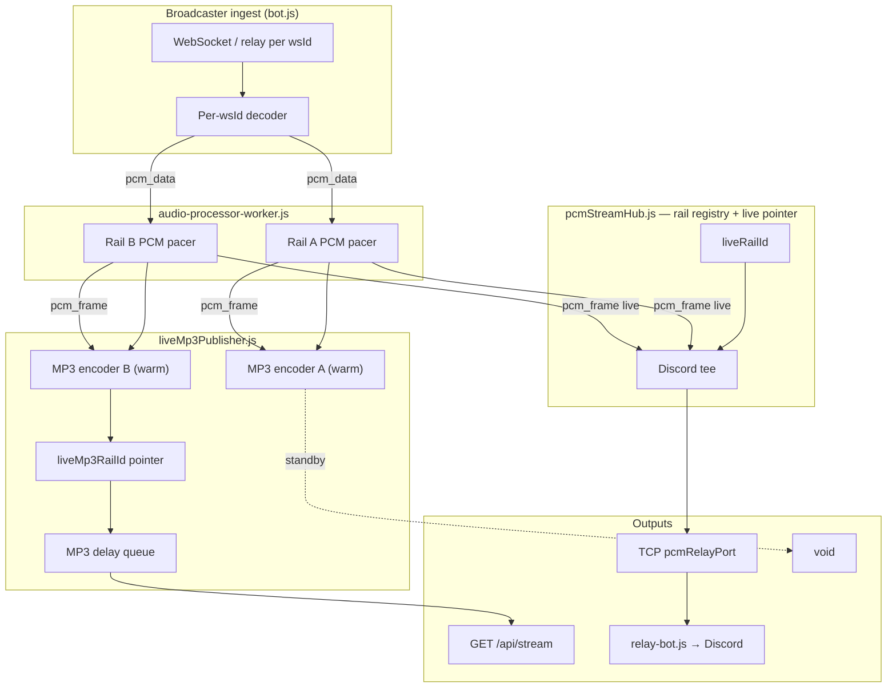
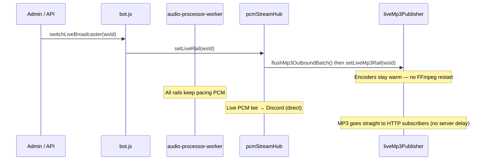

# CollabFM audio pipeline

Reference for the broadcast/stream/Discord architecture, debugging, revert, and history.

Last updated: 2026-06-24 — **PCM-native hub** (live rail switches in PCM; MP3 encode once at the edge for web).

---

## Quick summary

| Output | Format on the wire | Rail switching |
|--------|-------------------|----------------|
| Web (`/api/stream`) | MP3 (`audio/mpeg`) | Yes — via `pcmStreamHub.js` |
| Discord voice bot | PCM s16le 48 kHz stereo | Worker-paced PCM → TCP relay (no hub delay, no extra pacer) |
| Broadcaster ingest | Raw PCM / WebM per WS | Per-`wsId` worker pacer → `pcm_frame` |

**No PCM delay.** Worker emits steady 20 ms frames → encode immediately → web MP3 has no server-side delay (`webStreamDelayMs` fixed at 0). Discord gets paced PCM directly.

---

## Architecture (current)



### Rail switch



---

## File map

| File | Role |
|------|------|
| `backend/bot.js` | WS ingest, worker IPC, PCM relay TCP, `wireLivePcmOutputs()` |
| `backend/audio-processor-worker.js` | Per-rail PCM pacer → `pcm_frame` |
| `backend/src/radio/pcmStreamHub.js` | Rail registry, live pointer, Discord tee |
| `backend/src/radio/liveMp3Publisher.js` | Per-rail MP3 encoders, post-encode delay, HTTP fan-out |
| `backend/src/radio/discordPcmPacer.js` | **Legacy** — was for MP3-decode jitter; unused with native PCM |
| `backend/src/radio/streamHub.js` | Facade re-exporting the above (stable import path) |
| `backend/src/radio/discordHubPcm.js` | **Legacy** — MP3 decode bridge (unused; kept for revert) |
| `backend/relay-bot.js` | PCM TCP client → Discord voice |
| `backend/config.json` | `audio.*`, `server.pcmRelayPort` |
| `frontend/src/hooks/useRadioPlayer.ts` | Web player (MP3 URL) |

### Processes

1. **Main server** — `bot.js`
2. **Voice bot** — `relay-bot.js`

---

## Data flow

1. Broadcaster WS → decode → `sendAudioDataToWorker(chunk, wsId)`
2. Worker paces 20 ms frames → `pcm_frame` → `publishPcmFrame(frame, railId)`
3. Live rail PCM → `forwardPcmFrameToRelay` → relay-bot → Discord
4. All rails → `feedRailPcm` → per-rail FFmpeg MP3 encoder (warm on standby)
5. Live rail MP3 → batched HTTP subscribers

---

## Configuration

**Server** (`config.json`): `webPort`, `wsPort`, `pcmRelayPort`, `storageDir`, `debugLogDir`, `allowedOrigins`.

**Admin → Radio** (SQLite, live where noted):

| Key | Purpose |
|-----|---------|
| `limits.maxStageUsers` | Stage slot cap — **live** |
| `limits.logRetentionCount` | Debug log files kept — pruned on save |
| `audio.pcmMaxBufferMs` / `pcmMinBufferMs` | Worker rail buffering — **live** |
| `audio.discordBufferFrames` / `discordRelayBufferMs` | relay-bot join buffer — next voice join |
| `audio.silenceDebounceChunks` / `audioDebounceChunks` / `silenceThreshold` | Silence detection tuning |

Fixed in code (not config): `webStreamDelayMs`, `pcmInitialBufferMs`, and `pcmUnderrunHoldMs` are all `0`.

Optional cache TTLs (defaults in code): `limits.lastfmCacheTtlMs` (600000), `limits.albumArtCacheTtlMs` (300000).

First-run defaults: `scripts/ensure-config.js` (server file) and Admin → Radio (operational settings seeded on first DB init).

---

## DJ switch

- `switchLiveBroadcaster(wsId)` → `setLiveRail(wsId)`
- Handoff: flush trailing MP3 batch, swap `liveMp3RailId` — **no encoder restart**, HTTP connection stays open
- Warm rails: PCM queues drain into per-rail MP3 encoders; non-live MP3 discarded

---

## Logging

| Where | What |
|-------|------|
| Main server stdout | `Broadcast hub: PCM rails`, `PCM relay forwarded` |
| `backend/logs/stream-debug-*.log` | `stream_hub_handoff_committed`, worker events |
| relay-bot | `[relay-bot] PCM stream stale` |

---

## Revert to MP3-native hub (pre-2026-06-24)

If PCM hub must be rolled back, restore this behavior:

1. `streamHub.js` — MP3 chunk rails + `publishEncodedChunk`
2. `audio-processor-worker.js` — per-rail FFmpeg MP3 encoders + `encoded_chunk`
3. `bot.js` — `setOutboundChunkTap` → `createDiscordHubPcmBridge`
4. Remove or bypass `pcmStreamHub.js`, `liveMp3Publisher.js`, `wireLivePcmOutputs`

**Checkpoint grep:**

```
publishEncodedChunk
setOutboundChunkTap
createDiscordHubPcmBridge
encoded_chunk
```

**Legacy file kept on purpose:** `src/radio/discordHubPcm.js` (see git history for pre-2026-06-24 MP3 hub revert).

---

## Changelog

| Date | Notes |
|------|-------|
| 2026-06-24 (am) | Doc: MP3 hub + Discord MP3 tap era |
| 2026-06-24 (pm) | **Shipped PCM-native hub** — `pcmStreamHub`, `liveMp3Publisher`, worker `pcm_frame` |
